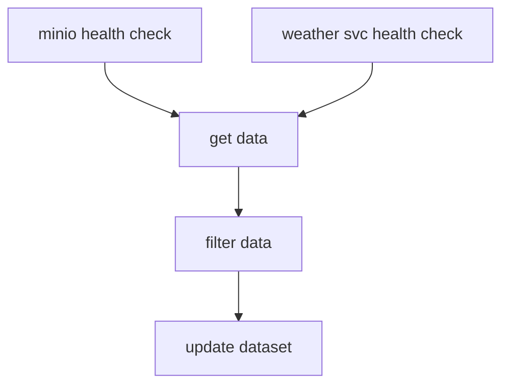

# Python for DevOps / Apache Airflow 101

rozsah: 4-5 dní

Tento kurz je pre všetkých tých, ktorí rozmýšľajú o tom, ako im môže jazyk Python pomôcť v ich každodennej práci. Kurz sa nevenuje pokročilým programátorským technikám jazyka, ale konkrétnemu a praktickému využitiu populárnych knižníc a nástrojov jazyka Python.

V rámci kurzu si pomocou platformy [Apache Airflow](https://airflow.apache.org/) vytvoríme a automatizujeme jednoduchý workflow, ktorý bude v pravidelných intervaloch sťahovať informácie o aktuálnom počasí zo serveru [openweathermap.org](https://openweathermap.org/). Stiahnuté údaje vyfiltrujeme a aktualizujeme dataset uložený v službe S3/Minio. Z tohto datasetu následne budeme automaticky vytvárať denné PDF reporty.

Pre absolvovanie kurzu je potrené poznať minimálne základy jazyka Python. Znalosť Docker-a je výhodou.


## Preberané témy

* základy práce s [Apache Airflow](https://airflow.apache.org/)
* tvorba HTTP dopytov pomocou knižníc [requests](https://requests.readthedocs.io/en/latest/)/[httpx](https://www.python-httpx.org/)
* knižnica [Boto3](https://boto3.amazonaws.com/v1/documentation/api/latest/index.html) na komunikáciu so službami typu object storage [S3](https://aws.amazon.com/s3/)/[MinIO](https://min.io/)
* modul [pathlib](https://docs.python.org/3/library/pathlib.html)
* spracovanie dát uložených vo formáte CSV pomocou knižnice [Pandas](https://pandas.pydata.org/)
* tvorba reportov pomocou knižnice [Jinja](https://jinja.palletsprojects.com/en/3.1.x/)
* generovanie PDF reportov pomocou knižnice [WeasyPrint](https://www.courtbouillon.org/weasyprint)
* práca s časom a dátumom pomocou knižnice [Pendulum](https://pendulum.eustace.io/)
* tvorba nástrojov s parametrami z príkazového riadku
* finty/tipy/triky/ďalšie nástroje, ktoré oceníte pre svoju prácu


## Literatúra

* [Python – Kompletní příručka jazyka pro verzi 3.10](https://www.martinus.sk/?uItem=1429819) - Kniha venovaná jazyku Python verzie 3.10.
* [Python - knihovny pro práci s daty](https://www.martinus.sk/?uItem=1845141) - Kniha predstavuje knižnice jazyka Python, ktoré sa používajú na prácu s dátami (napr. pandas, pathlib, csv, json, matplotlib a iné)


## Výsledné workflovy




```
   +--------------------+
   | minio health check |
   +--------------------+
              |
              v
        +----------+    +-------------+    +----------------+
        | get data | -> | filter data | -> | update dataset |
        +----------+    +-------------+    +----------------+
              ^
              |
+--------------------------+
| weather svc health check |
+--------------------------+


+--------------------+    +----------+    +---------------+    +---------------+
| minio health check | -> | get data | -> | create report | -> | upload report |
+--------------------+    +----------+    +---------------+    +---------------+
```