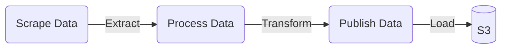

# The Project


## Workflow


```mermaid
flowchart LR
    A(Scrape Data) -->|Extract| B(Process Data)
    B -->|Transform| C(Publish  Data)
    C -->|Load| D[(S3)]
```

```bash
$ scrape_data | process_data | publish_data
```


## Init environment

Create virtual environment first:

```bash
$ python -m venv venv/
```

Activate environmnet:

```bash
$ source venv/bin/activate
```

Install required packages:

```bash
$ (venv) pip install -r requirements.txt
```

